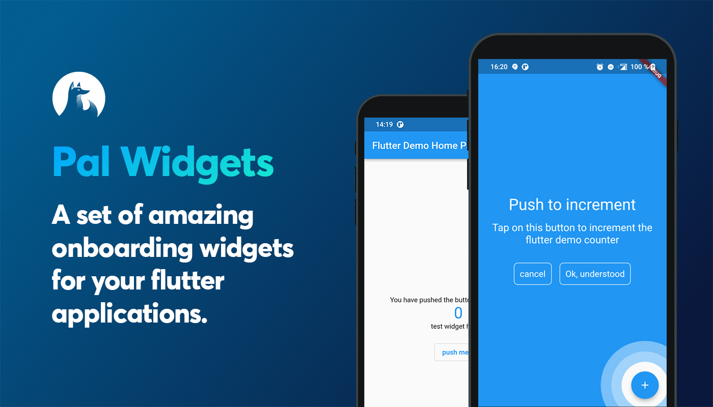

<p align="left">

</p>
<br>
<p align="center">
<a href="https://github.com/Apparence-io/pal-widgets/actions"></a>
<a href="https://codecov.io/gh/Apparence-io/pal-widgets"></a>
<a href="https://opensource.org/licenses/MIT"></a>
</p>
<br>
# Pal widgets
A flutter package for better onboarding. 

## Install package
add in your pubspec.yaml dependencies

```pal-widgets: 0.0.1```

## Anchored helper
This widgets is highly inspired by google onboardings. This shows a circle around any widgets you want and add an overlay were you can add 
a message. 

First embbed you page or your app with a **HelperOrchestrator** widget. 
```dart
HelperOrchestrator(
    child: Scaffold(
        appBar: AppBar(
            title: Text(widget.title),
        ),
        body: ...
    ),
)
```

You now have to get a key *text1* for the widget you want to reference using 
```dart 
Text(
    '$_counter',
    key: HelperOrchestrator.of(context).generateKey('text1'),
),
```

You can now show an anchored helper using 
```dart
final helper = AnchoredHelper(
    anchorKeyId: 'text1',
    title: const Text(
        'Title lorem pitume',
        textAlign: TextAlign.center,
        style: TextStyle(
        color: Colors.white,
        fontSize: 32,
        ),
    ),
    description: const Text(
        'Lorem ipsum lorem ipsum lorem ipsum lorem ipsum lorem ipsum',
        textAlign: TextAlign.center,
        style: TextStyle(
        color: Colors.white,
        fontSize: 21,
        ),
    ),
    bgColor: Colors.blue,
    negativText: const Text('cancel'),
    positivText: const Text('Ok, understood'),
    onError: () => print("widget not found"),
    positivBtnStyle: helperOutlineBtnStyle,
    negativeBtnStyle: helperOutlineBtnStyle,
    onNegativTap: () =>
        HelperOrchestrator.of(context).hideHelper(),
    onPositivTap: () =>
        HelperOrchestrator.of(context).hideHelper(),
);
// this will show an overlayed anchored widget using the key text1
HelperOrchestrator.of(context).showAnchoredHelper('text1', helper);
```

## Any question? 
Contact us on [our twitter](https://twitter.com/PalFlutter) or email gautier[@@]pal-plugin.tech
